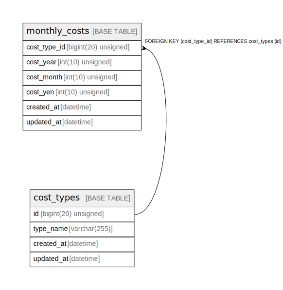

# code-gateway

## Tables

| Name | Columns | Comment | Type |
| ---- | ------- | ------- | ---- |
| [monthly_costs](monthly_costs.md) | 6 | 月次コスト | BASE TABLE |
| [cost_types](cost_types.md) | 4 | コスト種別 | BASE TABLE |
| [schema_migrations](schema_migrations.md) | 2 |  | BASE TABLE |

## Relations

---

> Generated by [tbls](https://github.com/k1LoW/tbls)
